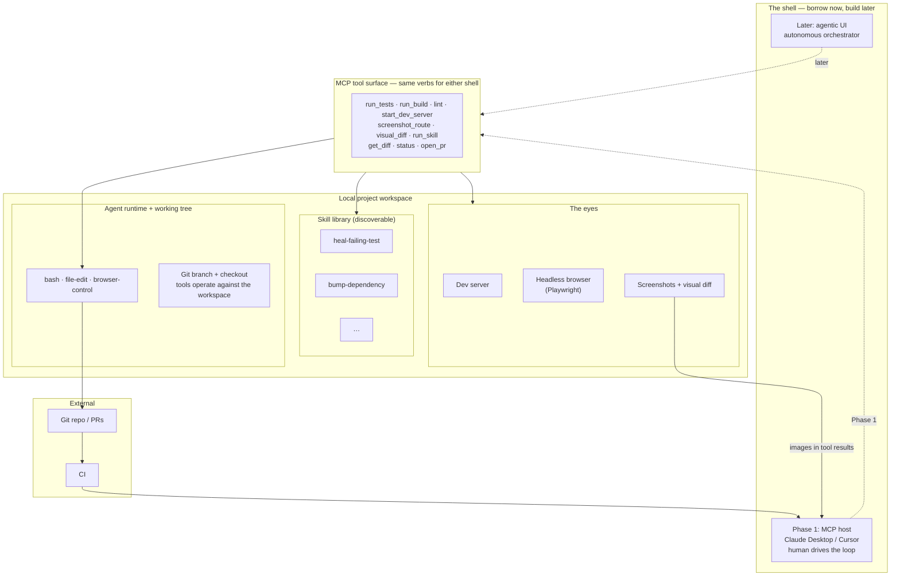
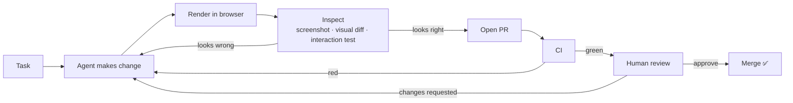

# Architecture

## The stack, layer by layer

**Pinned local toolchain** — Node, nx, Playwright, test runner, all on the host
and pinned per project. This is the boring part and should stay boring.

**Skills** — live in the repo under `skills/` and are discoverable by the agent.
The leverage point; see [README](./README.md#skills-are-the-flywheel).

**Agent runtime** — the thing running against the local workspace with `bash`,
file-edit, and browser-control tools.

**The eyes** — dev server + headless browser + screenshot/visual-diff. What lets
the agent verify UI work instead of guessing. Without this layer the whole thing
degrades into plausible-but-broken diffs.

**Workspace** — a configured local checkout the tools operate against. Isolation
is a git branch on that checkout, not a container. MCP-first removes the *UI*
for orchestration, not the workspace itself: the tools are stateless-ish, the
working tree holds the state. See [MCP.md](./MCP.md).

**MCP tool surface** — the substrate exposed as a set of meaningful verbs
(`run_tests`, `screenshot_route`, `run_skill`, `open_pr`, …). This is the stable
API. Both shells below call it unchanged. Detailed in [MCP.md](./MCP.md).

**The shell (borrow now → build later)** — the thing that drives the loop and
shows a human what's happening:
- *Phase 1 — MCP host:* Claude Desktop / Cursor. A human drives the loop; the
  host's multimodal model does the inspecting. Zero UI we had to build.
- *Later — agentic UI:* our own chat + dashboard (diffs, **screenshots**, CI
  status, approve / retry / take over) that automates the arrows a human doesn't
  need to sit on. Swaps in behind the *same* tool surface.

---

## Project profile — generic core, swappable target

The tool verbs are stack-agnostic; *how* to build, test, lint, and serve a given
workspace is configuration held in a thin **project profile**. The harness core
never learns about nx or Angular specifically — the nx-angular profile does.

The harness is pointed at a **target workspace**, and which one — the
[sandbox fixture](./SANDBOX.md) now, your real repo later — is config, not code.
Skills stay in the harness repo; git, tests, and PRs follow the target. So
porting isn't "grab the code," it's **point at the real repo + write its
profile.** This is the seam that keeps the eventual "grab it into my project" a
configuration change instead of surgery.

---

## System diagram

The dashed arrows are the swap point: **Phase 1 the host talks to the surface;
later the agentic UI does — the surface underneath never changes.** Note the
`screens → host` arrow: screenshots ride back in the tool results, so the host's
multimodal model is the inspector without any UI of ours.

---

## The verification loop

The agent doesn't open a PR until it has *inspected its own work*. Two gates
sit in front of a merge: the agent's own eyes (visual diff / interaction tests),
then CI. A human only appears at the end, and only for judgment calls.

The two self-correcting arrows — `inspect → agent` and `ci → agent` — are where
autonomy lives. Every loop the agent can close by itself is a loop a human
doesn't have to. Widening what those arrows can catch (better eyes, better
skills) is the whole game.

**In Phase 1, a human driving the MCP host sits at `inspect` and `review`** —
looking at the screenshot `screenshot_route` handed back, deciding to loop or
ship. The loop is identical; only the driver changes. The later agentic UI earns
its keep by automating the arrows that don't need judgment, and that judgment
call is exactly what [ROADMAP.md](./ROADMAP.md) climbs toward.
