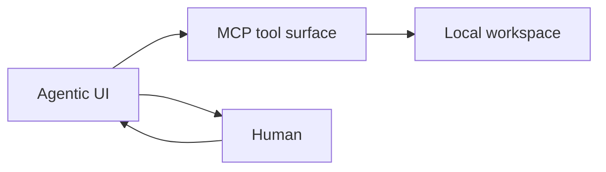

# M8 — Agentic UI (Phase 2)

*Own shell behind the same MCP tool surface.*

## Goal

Build the presentation + autonomous-orchestration layer deferred in
[ROADMAP.md](../ROADMAP.md) Phase 2. **Done when:** loop arrows that don't need
human judgment run without one.

Reference architecture:



The UI **does not reimplement** tools — it calls the same verbs as Cursor/Claude Desktop.

## Done when

1. Web app shows: task list, live tool call log, diffs, screenshots, CI status.
2. Orchestrator runs verification loop autonomously for Rung 1 tasks (fail → skill → verify).
3. Human gates: approve PR, request changes, take over workspace.
4. One end-to-end demo: seeded failure → autonomous fix → PR opened → human merges in UI.

## In scope

### Components

| Component | Responsibility |
|-----------|----------------|
| **API gateway** | HTTP/WebSocket front for MCP tools (or embed MCP server) |
| **Orchestrator** | State machine: task → edit → verify → PR |
| **Review UI** | Diff viewer, screenshot gallery, CI checks |
| **Auth** | Single-user/local first; SSO later |

### Orchestrator state machine

States aligned with [ARCHITECTURE.md](../ARCHITECTURE.md) loop:

```
ORIENT → FIX → VERIFY_LOCAL → VERIFY_VISUAL → SHIP → WAIT_CI → WAIT_HUMAN → DONE
         ↑___________|              |              |
              (retry)          (retry)       (retry on CI fail)
```

Automate arrows without judgment:

- `VERIFY_LOCAL` → retry FIX on test/lint/build fail
- `VERIFY_VISUAL` → retry FIX on visual_diff fail (if skill exists)
- `WAIT_CI` → retry FIX on CI fail (bounded attempts)

Human required:

- `WAIT_HUMAN` — approve / changes requested
- Rung 4 tasks — enter at FIX with human-provided spec only

### UI views

1. **Dashboard** — active workspaces, PRs in flight, recent merges
2. **Run detail** — tool call timeline, artifacts (images, logs)
3. **Review** — side-by-side diff + screenshot + approve button
4. **Takeover** — link to open workspace in Cursor / terminal

### Tech stack (proposal)

| Layer | Choice | Rationale |
|-------|--------|-----------|
| Frontend | React or Angular | Match team; Angular if dogfooding |
| API | Node + tRPC or REST | Same repo as harness |
| Realtime | WebSocket | Tool call streaming |
| MCP | Subprocess or shared lib | Reuse `createToolHandlers()` directly |

Prefer **shared library** over subprocess MCP for lower latency:

```typescript
import { createToolHandlers } from '@agentic-ui-dev/harness/tools';
```

Extract handlers package from harness if needed.

### Metrics dashboard

Surface [METRICS.md](../METRICS.md):

- human-minutes per merged PR
- autonomous loop success rate
- task mix by rung

## Out of scope (v1)

- Multi-tenant / teams
- Mobile app
- Replacing Cursor as primary editor
- Built-in LLM (orchestrator calls configured model API)

## Implementation steps

### Phase 2a — Read-only dashboard

1. Extract tool handlers to importable module.
2. HTTP API: `status`, `get_diff`, list recent runs (persist to sqlite).
3. UI: show screenshots + diffs from last run.

### Phase 2b — Orchestrator

4. State machine for Rung 1 heal-failing-test flow.
5. Model API integration (Claude/OpenAI) for FIX when no skill matches.
6. Bounded retry + escalation to human.

### Phase 2c — Ship + review

7. Wire `open_pr`, `ci_status`, approve action.
8. End-to-end demo recording.

## Acceptance test

Manual + automated:

- Automated: orchestrator completes heal-failing-test without human intervention
- Manual: human approves PR in UI, metrics record ≤ N minutes

## Files (expected)

```
ui/                          # frontend app
orchestrator/                # state machine + model calls
harness/src/api/             # HTTP layer
harness/src/store/           # run history sqlite
```

## Depends on

- M1 — ship loop
- M4 — skill discovery for orchestrator
- METRICS.md — dashboard widgets

## Risk

Building UI before substrate is solid → **gate Phase 2a on M1+M3 acceptance passing.**
