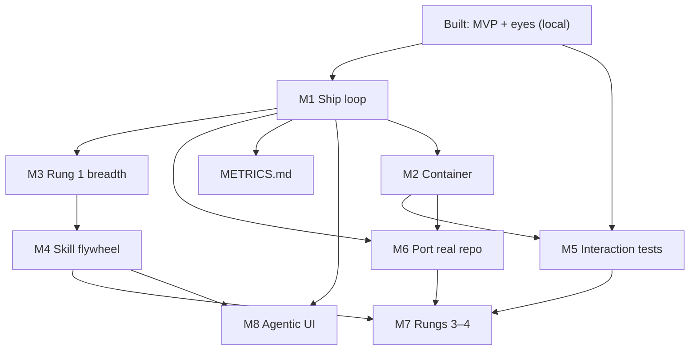

# Implementation plans

*Status: planning doc — maps pending work from [ROADMAP.md](../ROADMAP.md) to concrete builds.*

This directory is the **build backlog** for the agentic UI dev environment. Each
plan is a milestone-sized chunk with scope, dependencies, acceptance criteria,
and suggested file layout. Plans are ordered by dependency, not calendar time.

---

## Current state (built)

| Component | Status | Notes |
|-----------|--------|-------|
| MCP server (local) | ✅ | `harness/src/index.ts` |
| CI oracle (partial) | ✅ | `run_tests`, `lint` — no `run_build` |
| Eyes (local) | ✅ | `start/stop_dev_server`, `screenshot_route`, `visual_diff` |
| Skills (specimen-specific) | ✅ | `heal-failing-test`, `heal-visual-regression` |
| nx-angular profile | ✅ | Local checkout only |
| Sandbox fixture | ✅ | Specimen B (test) + catalog banner (visual) |
| Acceptance tests | ✅ | `acceptance`, `acceptance:eyes` |
| Container | ❌ | |
| `run_build` | ❌ | |
| `open_pr` / CI | ❌ | Loop stops at `get_diff` |
| Interaction tests | ❌ | |
| Skill discovery | ❌ | Hardcoded registry |
| Metrics | ❌ | [METRICS.md](../METRICS.md) not written |
| Agentic UI (Phase 2) | ❌ | |

Phase 1 **done-when** (from roadmap): Rungs 0–2 working end-to-end through an MCP
host. We are roughly at **Rung 0 (local)** + **Rung 1 (two specimens only)**.

---

## Milestone index

| # | Plan | Closes | Depends on |
|---|------|--------|------------|
| M1 | [Ship loop](./M1-ship-loop.md) | `run_build`, `open_pr`, CI status | — |
| M2 | [Container lifecycle](./M2-container-lifecycle.md) | Per-branch Docker workspace | M1 (optional: parallel) |
| M3 | [Rung 1 breadth](./M3-rung1-breadth.md) | More skills + specimens A/C | M1 |
| M4 | [Skill flywheel](./M4-skill-flywheel.md) | Discoverable skill library (Rung 2) | M3 |
| M5 | [Interaction tests](./M5-interaction-tests.md) | Browser actions + interaction oracle | Eyes (built), M2 |
| M6 | [Port to real repo](./M6-port-real-repo.md) | Second project profile | M1, M2 |
| M7 | [Rungs 3–4](./M7-rungs-3-4.md) | Wider task types | M4, M5 |
| M8 | [Agentic UI](./M8-agentic-ui.md) | Phase 2 shell | M1–M4 minimum |
| — | [METRICS.md](../METRICS.md) | Measurement model | M1 (instrumentation) |

---

## Dependency graph

---

## Principles (carry into every plan)

1. **Same tool verbs forever** — new capabilities extend the MCP surface; Phase 2
   UI calls the same API.
2. **Profile, not fork** — stack specifics live in project profiles, not harness core.
3. **Acceptance test per milestone** — each plan must define a pass/fail walkthrough.
4. **Specimens over mocks** — sandbox gets deliberately breakable fixtures, not
   stubbed tool responses.
5. **Whole suite as oracle** — a fix that greens one test while breaking another
   is a fail.

---

## Docs in this set

- [M1 — Ship loop](./M1-ship-loop.md)
- [M2 — Container lifecycle](./M2-container-lifecycle.md)
- [M3 — Rung 1 breadth](./M3-rung1-breadth.md)
- [M4 — Skill flywheel](./M4-skill-flywheel.md)
- [M5 — Interaction tests](./M5-interaction-tests.md)
- [M6 — Port to real repo](./M6-port-real-repo.md)
- [M7 — Rungs 3–4](./M7-rungs-3-4.md)
- [M8 — Agentic UI](./M8-agentic-ui.md)
